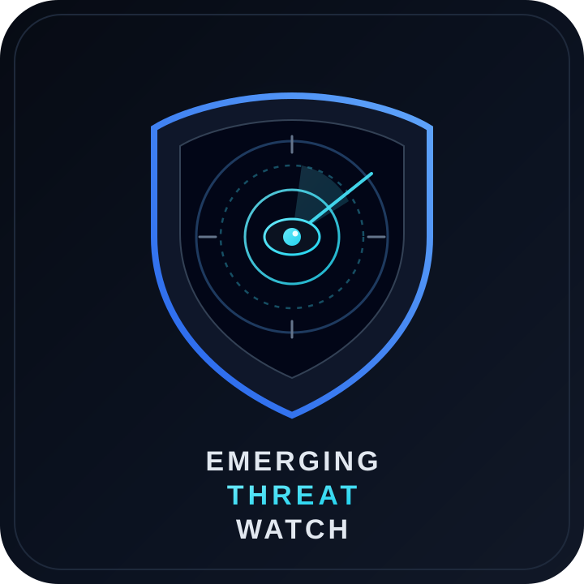

<p align="center">
  
</p>

<h1 align="center">Emerging Threat Watch</h1>

<p align="center">
  <strong>Independent, evidence-driven threat-intelligence investigations</strong><br/>
  Defensive research only · Case-isolated family packages · Law-enforcement–ready deliverables
</p>

<p align="center">
  <a href="https://github.com/theworker02/emerging-threat-watch-1"></a>
  
  
  
  
</p>

---

## Table of contents

1. [Mission](#mission)
2. [What this repository is (and is not)](#what-this-repository-is-and-is-not)
3. [Active Phase 1 corpus](#active-phase-1-corpus)
4. [Candidate / comparator stubs](#candidate--comparator-stubs)
5. [Case Isolation Rule (mandatory)](#case-isolation-rule-mandatory)
6. [Repository layout](#repository-layout)
7. [Standardized investigation package](#standardized-investigation-package)
8. [Evidence, claims, and provenance](#evidence-claims-and-provenance)
9. [Law-enforcement / IC3 deliverables](#law-enforcement--ic3-deliverables)
10. [Current phase & program status](#current-phase--program-status)
11. [Contribute intelligence](#contribute-intelligence)
12. [Quick start for researchers](#quick-start-for-researchers)
13. [Security & handling](#security--handling)
14. [Governance documents](#governance-documents)
15. [License & disclaimer](#license--disclaimer)

---

## Mission

**Emerging Threat Watch (ETW)** builds reproducible, provenance-graded investigation packages for emerging malware families and closely related candidate threats. Each family is treated as an **independent case**: indicators, attribution, infrastructure relationships, and conclusions are never transferred across cases without **direct connecting evidence**.

The program prioritizes:

- **Evidence before narrative** — every technical assertion is claim-ledgered with source class and confidence
- **Passive collection by default** — no malware execution, C2 interaction, or exploitation in the course of research
- **Defender and LE utility** — detection notes, ATT&CK mappings, STIX/CSV IOC corpora, and per-family IC3 briefs
- **Honest uncertainty** — `UNVERIFIED`, `ASSOCIATION_ONLY`, and explicit **non-authorship defaults** when vendors co-disclose or techniques overlap

Official brand mark: [`assets/etw-logo.svg`](assets/etw-logo.svg).

---

## What this repository is (and is not)

| This repository **is** | This repository **is not** |
|------------------------|----------------------------|
| A defensive CTI research workspace | A malware sample dump or exploit kit |
| Claim ledgers, source archives, IOC corpora | A live C2 monitoring or interactive tasking platform |
| Independent family case packages | A merged “mega-campaign” attribution dump |
| Draft IC3 / FBI filing packages for human review | An automatic submission to law enforcement |
| Empty ledgers or invented IOCs | Permission to invent IOCs or force lineage |

> **Hard boundary:** This repository must never contain functionality intended to improve, weaponize, deploy, propagate, conceal, or operationalize malware.

See [`DISCLAIMER.md`](DISCLAIMER.md) and [`SECURITY.md`](SECURITY.md).

---

## Active Phase 1 corpus

Seven **active** investigation trees under `investigations/`:

| Family | Focus | Platform | Primary research emphasis | Case / IC3 ID |
|--------|-------|----------|---------------------------|---------------|
| **Rapuncel** | Infostealer | Windows | GitHub/SEO distribution; BoryptGrab lineage assessment | `ETW-RAP-IC3` |
| **Settra** | Ransomware | Windows (enterprise) | Password-gated encryptor; anti-analysis; ransom artifacts | `ETW-SET-IC3` |
| **RatHat** | Banking RAT | Android | APK metadata; Accessibility/ADB; AI-assisted UI control | `ETW-RAT-IC3` |
| **NodeRabbit** | Cross-platform RAT | Windows / Linux / macOS | Node.js execution; fake coding-challenge delivery | `ETW-NRB-IC3` |
| **PollCat** | Cross-platform JS RAT | Windows / Linux / macOS | Obfuscated JS RAT; coding-challenge delivery; lineage vs NodeRabbit (**non-authorship default**) | `ETW-POL-IC3` |
| **SynkLoader** | Modular loader | Windows (enterprise) | Teams / IT-helpdesk phishing; mixed-language modules; fake lock screen | `ETW-SYN-IC3` |
| **Showboat** | Post-exploitation | Linux (telecom) | Modular Linux post-ex; telecom targeting; historical activity vs disclosure | `ETW-SHO-IC3` |

---

## Candidate / comparator packages (primary-frozen)

Former empty stubs **09–15** now have frozen primaries and transcribed IOCs (`PRIMARY_FROZEN`). They are **not IC3-filed** until a human files them. Matanbuchus remains a SynkLoader technique comparator only.

| Family | Kind | Why tracked |
|--------|------|-------------|
| **Abyssos** | Filed (promoted from candidate) | Modular RAT — Zscaler primary frozen 2026-09-20; `ETW-ABY-IC3` **FILED_IC3** `a23f0a9d6799480e994284416d354713` |
| **SharkLoader** | Filed | StrikeShark / Cobalt Strike loader — Securelist 2026-06-24; `ETW-SHK-IC3` **FILED_IC3** `6ed57963d0c64750aa14b6fcbaa2e576` |
| **TencShell** | Primary-frozen | Customized Rshell Go implant — Cato CTRL; 15 TEN-IND |
| **MiniFast** | Primary-frozen | Zoom trust abuse / Nimbus Manticore — Check Point; 30 MNF-IND; PollCat context only — **not merged** |
| **Argamal** | Primary-frozen | Trojanized adult games RAT — Securelist 2026-06-03; 22 ARG-IND |
| **Okobot** | Primary-frozen | Multi-payload / OkoSpyware — Securelist; 30 OKO-IND |
| **Matanbuchus** | Technique comparator (primary-frozen) | SynkLoader Teams / ChaCha20 **COMMON TECHNIQUE** only — 15 MAT-IND; authorship `NOT_ESTABLISHED` |
| **StarlandRAT** | Primary-frozen | Talos UAT-11795 / WLDR — 17 STR-IND; Telegram / Polygon C2 class |

Catalogs:

- [`docs/CANDIDATE_FAMILIES.md`](docs/CANDIDATE_FAMILIES.md)
- [`intelligence/candidate-families.csv`](intelligence/candidate-families.csv)
- [`docs/TECHNIQUE_COMPARATORS.md`](docs/TECHNIQUE_COMPARATORS.md)
- [`intelligence/technique-comparators.csv`](intelligence/technique-comparators.csv)

---

## Case Isolation Rule (mandatory)

> **Each malware family is an independent case.**
>
> Never transfer an IOC, attribution, infrastructure relationship, TTP, capability, or conclusion from one investigation to another **without direct evidence connecting them**.
>
> Similar behavior alone does **not** establish shared operators or lineage.

### Named non-authorship / technique-only defaults

| Pairing | Rule |
|---------|------|
| **PollCat ↔ NodeRabbit** | Co-disclosure in the same Kaspersky paper does **not** establish shared authorship. Compare only as `COMMON TECHNIQUE` / lineage assessment with an explicit **non-authorship default** unless direct linking evidence exists. |
| **Matanbuchus ↔ SynkLoader** | Technique / structural context only — `authorship_link=NOT_ESTABLISHED` unless PRIMARY evidence says otherwise. |
| **MiniFast ↔ PollCat** | Context only — do **not** merge cases. |

Cross-case comparisons belong only in `reports/landscape/` and `intelligence/campaign-relationships.csv`, and must be labeled as **comparative observations**—not shared attribution—unless linkage evidence exists.

---

## Repository layout

```
emerging-threat-watch/
├── README.md                 ← you are here
├── assets/etw-logo.svg       ← official program logo
├── METHODOLOGY.md            ← provenance, confidence, research emphases
├── DISCLAIMER.md
├── SECURITY.md
├── CONTRIBUTING.md
├── CODE_OF_CONDUCT.md
├── LICENSE
├── CHANGELOG.md
├── research_plan.md
├── docs/
│   ├── SUBMIT_INTEL.md       ← tip / issue intake
│   ├── CANDIDATE_FAMILIES.md
│   ├── TECHNIQUE_COMPARATORS.md
│   ├── PHASE1_PROGRAM_STATUS.md
│   └── ENFORCEMENT_READINESS.md
├── investigations/
│   ├── {rapuncel,settra,rathat,noderabbit,pollcat,synkloader,showboat}/
│   └── {abyssos,sharkloader,tencshell,minifast,argamal,okobot,matanbuchus,starlandrat}/
├── evidence/                 ← primary-source archives + passive observations
├── intelligence/             ← cross-cutting CSV ledgers (relationships, IOCs, timelines)
├── shared/
│   ├── schemas/              ← claim / evidence JSON schemas
│   ├── methodology/          ← autonomy, OSINT, evidence ID policy, gates
│   ├── tooling/              ← gate_ctl and validation helpers
│   ├── templates/
│   ├── attack/
│   └── detection/
├── gates/                    ← Tier-1 security gates (see GATED_AUTONOMY.md)
├── research/                 ← trust-surface and related matrices
└── reports/
    ├── landscape/
    └── law-enforcement/      ← canonical IC3 / FBI packages + CTI evidence repo
```

---

## Standardized investigation package

Each family independently produces (active trees denser; stubs skeleton-only until freeze):

| # | Artifact | Typical location |
|---|----------|------------------|
| 1 | Evidence ledger | `investigations/<family>/evidence/` |
| 2 | Source ledger | `evidence/primary-sources/<family>/` + manifests |
| 3 | IOC corpus (CSV / JSON / STIX) | `investigations/<family>/iocs/` |
| 4 | Timeline | `investigations/<family>/timelines/` |
| 5 | Technical analysis | `investigations/<family>/analysis/` |
| 6 | ATT&CK mapping | `investigations/<family>/attack/` |
| 7 | Detection engineering | `investigations/<family>/detections/` |
| 8 | Intelligence gaps | `investigations/<family>/gaps/` |
| 9 | Baseline / threat report (Markdown → PDF deferred) | `investigations/<family>/PHASE1_BASELINE_REPORT.md` |
| 10 | Family-specific IC3 brief | `reports/law-enforcement/packages/NN-<family>/` |

Claim IDs follow family prefixes: `RAP-CLAIM-####`, `SET-CLAIM-####`, `RAT-CLAIM-####`, `NRB-CLAIM-####`, `POL-CLAIM-####`, `SYN-CLAIM-####`, `SHO-CLAIM-####`.

---

## Evidence, claims, and provenance

Traceability path: **Report → Claim → Evidence → Original source.**

Provenance codes (see [`METHODOLOGY.md`](METHODOLOGY.md)):

| Code | Meaning |
|------|---------|
| `OBSERVED` / `OBSERVED_PASSIVE` | Independently observed by this investigation |
| `PRIMARY-SOURCE` | Directly from the original analyzing organization / researcher |
| `CORROBORATED` | ≥2 sufficiently independent sources, or ETW passive evidence supports a vendor claim |
| `SECONDARY` | Reported but not the original source |
| `INFERRED` | Derived from evidence; not directly demonstrated |
| `UNVERIFIED` | Claim exists; insufficient evidence |
| `CONTRADICTED` | Reliable evidence conflicts |
| `ASSOCIATION_ONLY` | Weak co-occurrence — not ownership |
| `INFRASTRUCTURE_OVERLAP` | Shared technical artifact — not actor identity |

**Autonomy policy:** Permitted passive collection runs without per-query approval. Prohibited: malware execution, C2 interaction, auth to attacker systems, exploitation. Details:

- [`shared/methodology/AUTONOMOUS_COLLECTION_POLICY.md`](shared/methodology/AUTONOMOUS_COLLECTION_POLICY.md)
- [`shared/methodology/GATED_AUTONOMY.md`](shared/methodology/GATED_AUTONOMY.md) · `python shared/tooling/gate_ctl.py list`
- [`shared/methodology/EVIDENCE_ID_POLICY.md`](shared/methodology/EVIDENCE_ID_POLICY.md)

Published indicators use `*-IND-*` IDs in `investigations/*/evidence/published-indicators.csv`. Combined IOC rollups live under `intelligence/` and `shared/combined_iocs.csv` — **none OBSERVED** until passive validation.

---

## Law-enforcement / IC3 deliverables

Canonical home: [`reports/law-enforcement/`](reports/law-enforcement/).

| Artifact | Path |
|----------|------|
| **FBI / IC3 filing packages (canonical)** | [`reports/law-enforcement/`](reports/law-enforcement/) |
| **STIX evidentiary repository (LE ingest)** | [`reports/law-enforcement/CTI-Evidence-Repository/`](reports/law-enforcement/CTI-Evidence-Repository/) |
| Rapuncel | `reports/law-enforcement/packages/01-rapuncel/` (`ETW-RAP-IC3`) — **FILED_IC3** `208b747c6f7445f0af2b69a9d63acc36` (2026-09-19 4:44:37 PM EST) |
| Settra | `reports/law-enforcement/packages/02-settra/` (`ETW-SET-IC3`) — **FILED_IC3** `631d8b4800d04bc19cdbfc6662e5c52c` (2026-09-19 4:59:46 PM EST) |
| RatHat | `reports/law-enforcement/packages/03-rathat/` (`ETW-RAT-IC3`) — **FILED_IC3** `f92c4c2f0dd3481f898fdd125e728adf` (2026-09-19 5:08:29 PM EST) |
| NodeRabbit | `reports/law-enforcement/packages/04-noderabbit/` (`ETW-NRB-IC3`) — **FILED_IC3** `dded86972e9347e0be27a6597b4cf08a` (2026-09-19 5:15:51 PM EST) |
| PollCat | `reports/law-enforcement/packages/05-pollcat/` (`ETW-POL-IC3`) — **FILED_IC3** `98a4444754324e539dbbffcb10c70637` (2026-09-19 9:52:51 PM EST) |
| SynkLoader | `reports/law-enforcement/packages/06-synkloader/` (`ETW-SYN-IC3`) — **FILED_IC3** `3440d0c64dc240499ff66deaa3311a0b` (2026-09-19 10:04:35 PM EST) |
| Showboat | `reports/law-enforcement/packages/07-showboat/` (`ETW-SHO-IC3`) — **FILED_IC3** `db42033f319844c08ad103befebfca08` (2026-09-19 10:13:28 PM EST) |
| Abyssos | `reports/law-enforcement/packages/08-abyssos/` (`ETW-ABY-IC3`) — **FILED_IC3** `a23f0a9d6799480e994284416d354713` (2026-09-19 10:20:50 PM EST) |
| SharkLoader | `packages/09-sharkloader/` (`ETW-SHK-IC3`) — **FILED_IC3** `6ed57963d0c64750aa14b6fcbaa2e576` (2026-09-19 10:43:18 PM EST) |
| TencShell | `packages/10-tencshell/` (`ETW-TEN-IC3`) — **PRIMARY_FROZEN** 15 TEN-IND |
| MiniFast | `packages/11-minifast/` (`ETW-MNF-IC3`) — **PRIMARY_FROZEN** 30 MNF-IND |
| Argamal | `packages/12-argamal/` (`ETW-ARG-IC3`) — **PRIMARY_FROZEN** 22 ARG-IND |
| Okobot | `packages/13-okobot/` (`ETW-OKO-IC3`) — **PRIMARY_FROZEN** 30 OKO-IND |
| Matanbuchus | `packages/14-matanbuchus/` (`ETW-MAT-IC3`) — **PRIMARY_FROZEN** 15 MAT-IND (SynkLoader comparator only) |
| StarlandRAT | `packages/15-starlandrat/` (`ETW-STR-IC3`) — **PRIMARY_FROZEN** 17 STR-IND |
| Landscape comparison | `reports/landscape/EMERGING_THREAT_LANDSCAPE_REPORT.pdf` |

**Rules:**

- IC3 / FBI packages are **never combined** across families unless evidence actually connects the campaigns
- Drafts are **not** automatic submissions — human review is required before any filing
- Filled submission dossiers are gitignored (see `.gitignore`)

Start at [`reports/law-enforcement/README.md`](reports/law-enforcement/README.md).

---

## Current phase & program status

**Phase 1 — Evidence acquisition & claim corpus**  
**v1 freeze cutoff:** **2026-09-19**  
**Final threat-report PDFs:** deferred  
**Scale:** **9** filed families + **6** primary-frozen packages = **15** family folders

Operational pointers:

| Resource | Path |
|----------|------|
| Program status | [`docs/PHASE1_PROGRAM_STATUS.md`](docs/PHASE1_PROGRAM_STATUS.md) |
| Phase 1 summary | [`PHASE1_PROGRAM_SUMMARY.md`](PHASE1_PROGRAM_SUMMARY.md) |
| Research plan / seeds | [`research_plan.md`](research_plan.md), `shared/queries/` |
| Emerging threats overview | [`intelligence/emerging-threats.md`](intelligence/emerging-threats.md) |
| Per-family baselines | `investigations/<family>/PHASE1_BASELINE_REPORT.md` |
| Tracker collection seeds | `shared/queries/tracker_collection_seeds.csv` |
| Underground / commodity RAT OSINT (defensive) | [`shared/methodology/UNDERGROUND_AND_COMMODITY_RAT_OSINT.md`](shared/methodology/UNDERGROUND_AND_COMMODITY_RAT_OSINT.md) |

---

## Contribute intelligence

Have indicators, sightings, or corrections for active or primary-frozen families (**Rapuncel**, **Settra**, **RatHat**, **NodeRabbit**, **PollCat**, **SynkLoader**, **Showboat**, **Abyssos**, **SharkLoader**, **TencShell**, **MiniFast**, **Argamal**, **Okobot**, **Matanbuchus**, **StarlandRAT**)?

1. Open a GitHub issue on [theworker02/emerging-threat-watch-1](https://github.com/theworker02/emerging-threat-watch-1), **or**
2. Follow [`docs/SUBMIT_INTEL.md`](docs/SUBMIT_INTEL.md)

Tips support defensive research. Completed, human-reviewed packages under [`reports/law-enforcement/`](reports/law-enforcement/) are prepared for FBI / IC3 reporting. **Primary-frozen packages (09–15) are not IC3-filed until human filing.**

Code / docs contributions: see [`CONTRIBUTING.md`](CONTRIBUTING.md) and [`CODE_OF_CONDUCT.md`](CODE_OF_CONDUCT.md).

---

## Quick start for researchers

```bash
# Clone
git clone https://github.com/theworker02/emerging-threat-watch-1.git
cd emerging-threat-watch-1

# Read the rules of the road
#   METHODOLOGY.md  DISCLAIMER.md  SECURITY.md

# Pick one family — do not cross-contaminate IOCs
cd investigations/rapuncel   # example

# Review claim ledger + published indicators
#   claims/claims-ledger.csv
#   evidence/published-indicators.csv

# List Tier-1 gates (if using local tooling)
python shared/tooling/gate_ctl.py list
```

**Defanging:** In prose, prefer defanged indicators (`[.]`, `hxxps`). Machine-readable IOC files may contain literal values but must be clearly labeled.

---

## Security & handling

1. Never commit executable malware samples (`.exe`, `.dll`, `.sys`, `.apk`, …) — see `.gitignore`
2. Prefer hash / metadata manifests under sample folders
3. Shared tooling must remain **passive** (no C2 interaction)
4. Case isolation applies to operational response: do not block or hunt one family's indicators solely because of another family's findings
5. Report secrets, PII, or live malware found in-tree via private advisory — see [`SECURITY.md`](SECURITY.md)

---

## Governance documents

| Document | Purpose |
|----------|---------|
| [`METHODOLOGY.md`](METHODOLOGY.md) | Provenance, confidence, source hierarchy, family emphases |
| [`DISCLAIMER.md`](DISCLAIMER.md) | Legal / misuse boundaries |
| [`SECURITY.md`](SECURITY.md) | Security policy & handling rules |
| [`CONTRIBUTING.md`](CONTRIBUTING.md) | PR / evidence contribution norms |
| [`CODE_OF_CONDUCT.md`](CODE_OF_CONDUCT.md) | Community standards |
| [`CHANGELOG.md`](CHANGELOG.md) | Program changelog |
| [`LICENSE`](LICENSE) | License terms |

---

## License & disclaimer

See [`LICENSE`](LICENSE) and [`DISCLAIMER.md`](DISCLAIMER.md).

Content may describe publicly reported malware behavior. **Description is not endorsement or instruction for misuse.** Indicators may be historical, ephemeral, or incorrectly attributed in source material — always validate before operational use. Authors are not affiliated with the malware operators under investigation.

---

<p align="center">
  <br/>
  <sub>Emerging Threat Watch · Defensive CTI · Evidence first</sub>
</p>
