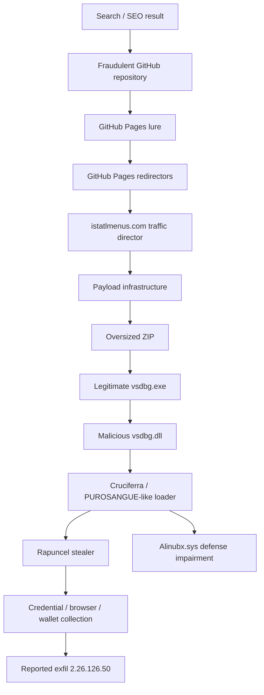
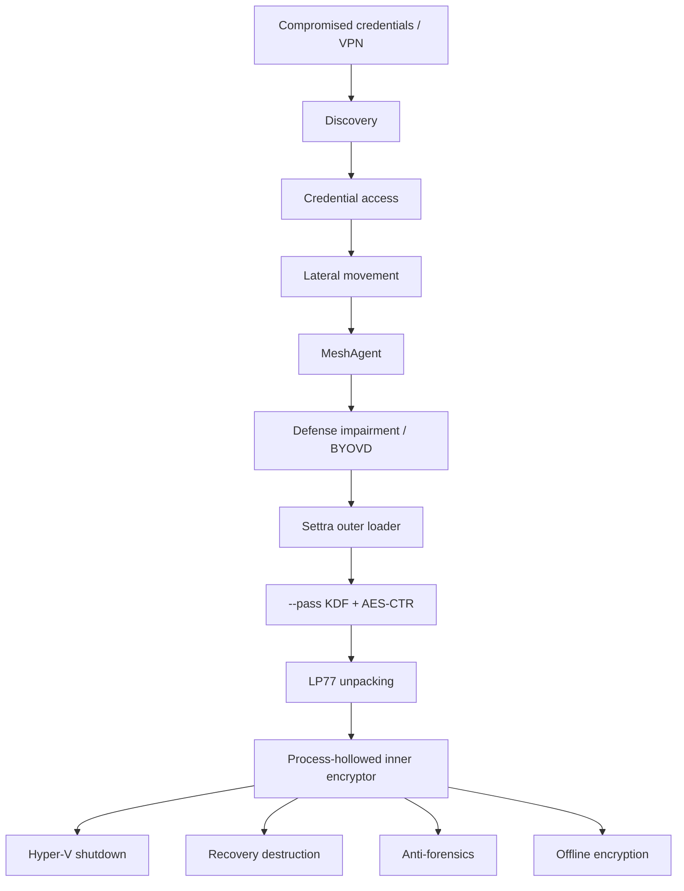
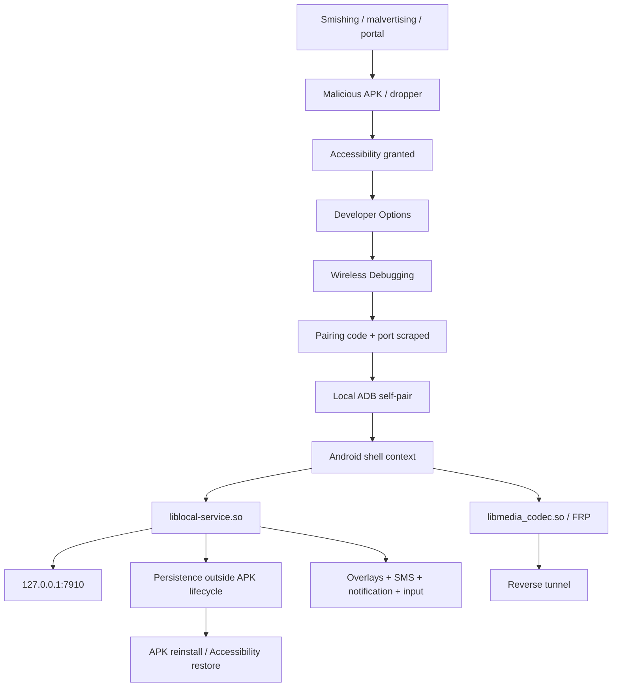
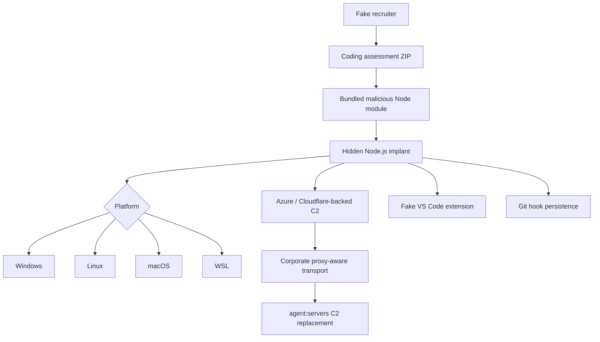

# Infection / Delivery Chains (Mermaid)

Provenance: PRIMARY-SOURCE reconstructions. Not independently OBSERVED by ETW.

## Rapuncel

## Settra

Note: Left column stages are **operator** (MOXFIVE/Huntress); right/encryptor stages are **malware** (Cynet).

## RatHat

## NodeRabbit

